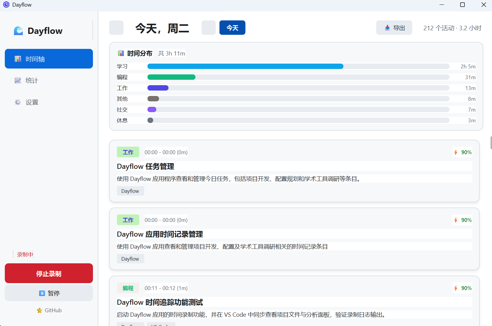
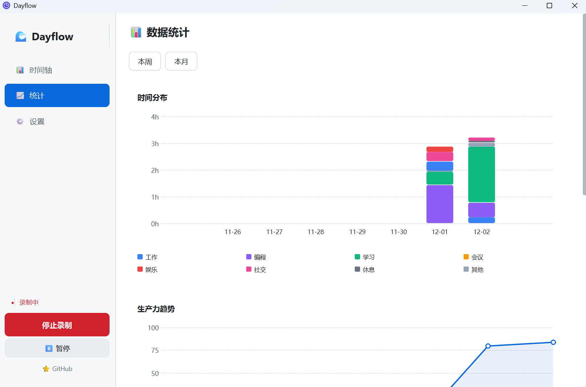
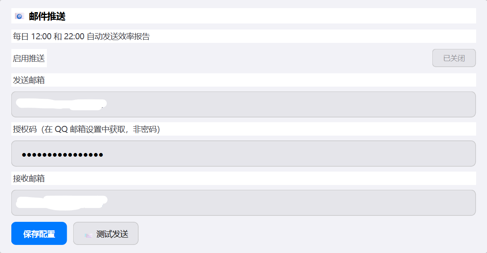
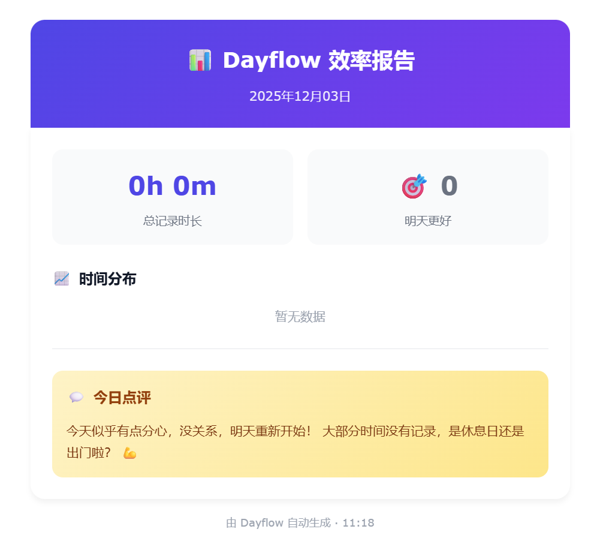
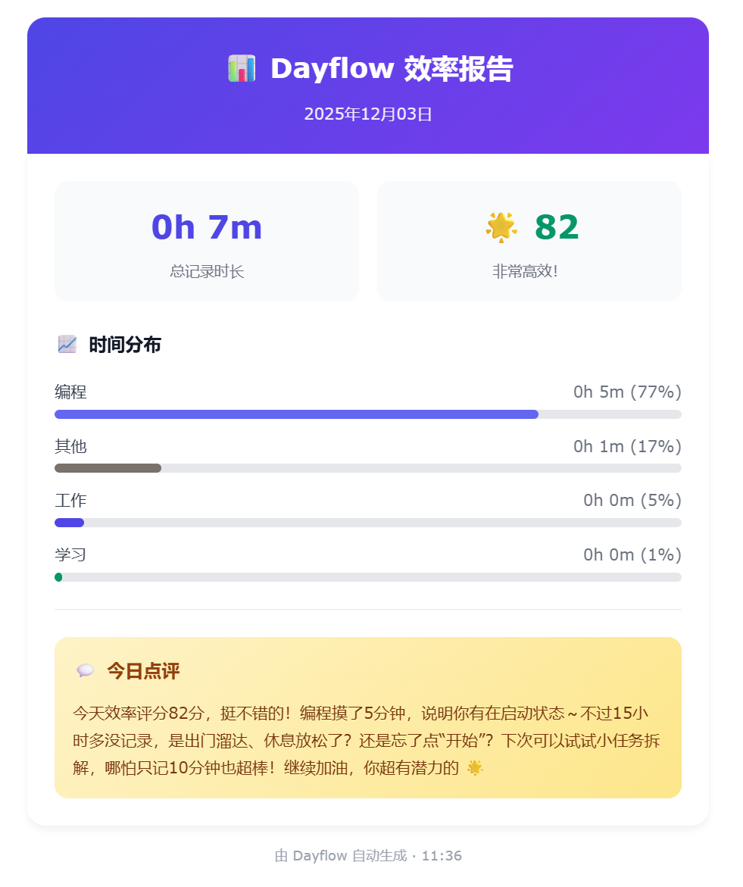

<div align="center">

# ⏱️ Dayflow for Windows

**智能时间追踪与生产力分析工具**

[](https://python.org)
[](https://doc.qt.io/qtforpython/)
[](LICENSE)
[](https://www.microsoft.com/windows)

*后台静默录屏 → AI 智能分析 → 可视化时间轴*

[](https://github.com/SeiShonagon520/Dayflow/releases)

**中文** | [English](README_EN.md)

</div>

---

## 🎯 这是什么？

**Dayflow** 是一款基于 AI 的智能时间追踪工具。它在后台静默录制你的屏幕，通过视觉大模型自动识别你在做什么，然后生成一目了然的时间轴，帮你了解每天的时间都花在哪里了。

### 💡 为什么需要它？

- **不知道时间去哪了？** → Dayflow 自动记录，无需手动打卡
- **想提高工作效率？** → AI 分析你的工作模式，发现分心点
- **需要工作日志？** → 自动生成每日活动报告
- **远程办公考勤？** → 客观记录工作时长和内容

### 🏆 核心优势

| 优势 | 说明 |
|------|------|
| **零操作** | 开启即用，无需手动记录，AI 全自动识别 |
| **超低功耗** | 1 FPS 录制 + 智能压缩，CPU 占用 < 1% |
| **隐私优先** | 数据本地存储，视频分析后自动删除 |
| **智能分类** | AI 自动识别：工作/学习/娱乐/社交/休息 |
| **生产力评分** | 每段活动的效率打分，量化你的专注度 |

---

## ✨ 功能特性

| 功能 | 描述 |
|------|------|
| 🎥 **低功耗录屏** | 1 FPS 极低资源占用，后台静默运行 |
| 🪟 **窗口追踪** | 使用 Windows API 采集真实应用名称和窗口标题 |
| 🤖 **AI 智能分析** | 视觉大模型识别屏幕活动，自动归类 |
| 📊 **时间轴可视化** | 直观展示每日时间分配，一目了然 |
| 💡 **生产力洞察** | AI 驱动的效率评估与改进建议 |
| 🔒 **隐私安全** | 数据本地存储，分析后自动清理视频 |

### 🆕 最新功能

| 功能 | 描述 |
|------|------|
| 🪟 **窗口追踪** | 自动采集真实应用名称，AI 识别更精准 |
| 📊 **Web 仪表盘** | 导出精美 HTML 报告，支持交互式图表，可分享 |
| 📧 **邮件日报** | 自动发送效率报告，支持自定义发送时间 |
| 📋 **深度分析报告** | 专业级行为分析，识别效率瓶颈，提供改进策略 |
| 🤖 **AI 点评** | AI 生成个性化每日总结，朋友式鼓励与建议 |
| �  **自动更新** | 检测新版本、后台下载、一键安装，保持最新 |
| 🚀 **开机自启动** | 支持开机自动启动并最小化到托盘 |
| 🪟 **自定义标题栏** | VS Code 风格，内置日志查看、支持最小化到托盘 |
| � ***统计面板** | 全新统计页面，查看时间分布与生产力趋势 |
| � **日S期切换** | 查看历史记录，支持前一天/后一天/今天快捷切换 |
| 📥 **CSV 导出** | 一键导出活动数据为 CSV 文件，便于分析和存档 |
| ⏸️ **暂停录制** | 处理隐私内容时可暂停，完成后继续录制 |
| 🎨 **主题切换** | IDE 风格暗色/亮色主题，自动保存偏好 |
| ⚙️ **可配置参数** | 邮件时间、采样帧数、API 超时等均可自定义 |
| 📦 **EXE 打包** | 支持打包为独立可执行文件，无需 Python 环境 |

### 📋 更新日志

#### v1.5.1 (2025-12)

**📊 统计页面全新设计**
- 全新仪表盘风格，精致质感，告别 AI 廉价感
- 顶部指标卡片：总时长、平均效率、深度工作次数、活动数量
- 双栏网格布局：左侧图表区 + 右侧数据区
- 环形图：类别时间分布可视化，支持悬停交互
- 折线图升级：渐变填充 + 贝塞尔曲线平滑
- 柱状图升级：渐变色彩 + 背景轨道
- 热力图精简：更紧凑的时段效率展示
- 周对比功能：本周 vs 上周数据对比
- 卡片阴影效果：更有层次感的视觉体验

**✏️ 卡片编辑功能**
- 支持右键菜单编辑/删除活动卡片
- 可修改：类别、标题、摘要、效率评分
- 点击卡片直接进入编辑模式

#### v1.5.0 (2025-12)

**🪟 窗口追踪增强**
- 新增 Windows API 窗口追踪，自动采集真实应用名称和窗口标题
- AI 分析时结合窗口信息，识别更精准

**🎨 UI 界面优化**
- 活动卡片新增左侧效率指示条（绿色/橙色/灰色三档）
- 深度工作徽章：60分钟以上活动显示 🔥 标识
- 侧边栏选中状态新增左侧蓝色指示条
- 录制状态实时显示时长（HH:MM:SS 格式）
- 系统托盘 tooltip 显示录制状态
- 空状态页面优化，新增引导图标和文案
- 页面标题字体层次优化（28px/700）
- 设置页面卡片间距增加

**🤖 AI 提示词优化**
- 简化转录提示词，减少冗余输出
- 充分利用窗口标题信息辅助识别
- 优化卡片生成提示词，提升分类准确性
- 邮件点评更自然，减少 AI 感

**🔧 数据处理改进**
- 窗口记录时间对齐优化
- 批次边界连续性处理
- 邮件合并逻辑优化（5分钟间隔阈值）

---

## 🖥️ 界面预览

### 时间轴页面



*时间轴页面：展示每日活动卡片，包含时间段、应用程序、活动摘要和生产力评分*

### 统计页面



*统计页面：仪表盘风格设计，顶部指标卡片 + 双栏布局，包含环形图、趋势图、热力图、周对比等*

统计页面功能：

| 功能 | 说明 |
|------|------|
| 📊 **指标卡片** | 总时长、平均效率、深度工作次数、活动数量，支持周对比 |
| 🍩 **环形图** | 类别时间分布可视化，悬停显示详情 |
| 📈 **趋势图** | 生产力趋势折线图，渐变填充 + 平滑曲线 |
| 📊 **柱状图** | 每日时间分布，堆叠显示各类别 |
| 🔥 **热力图** | 24小时效率分布，快速定位高效时段 |
| ⚖️ **周对比** | 本周 vs 上周数据对比，发现变化趋势 |
| 🎯 **今日目标** | 设定每日目标，追踪完成进度 |
| 📱 **应用排行** | 最常用应用/网站使用时长排行 |

### Web 仪能表盘

#### 日期选择


*日期范围选择：支持今日、昨日、本周、上周、本月、自定义日期范围*

#### 仪表盘报告


*Web 仪表盘：精美的 HTML 报告，包含交互式图表，可在浏览器中查看或分享*

Web 仪表盘功能让你可以将生产力数据导出为精美的 HTML 报告：

| 功能 | 说明 |
|------|------|
| 📈 **概览卡片** | 总时长、平均效率、深度工作时间、活动数量 |
| 🥧 **时间分布饼图** | 各类别时间占比可视化 |
| 📊 **每小时效率图** | 查看一天中不同时段的效率变化 |
| 📅 **周趋势图** | 最近 7 天的时长和效率趋势 |
| 🏆 **应用排行榜** | Top 5 最常用应用及使用时长 |
| 📋 **活动时间轴** | 完整活动列表，支持分类筛选 |
| 🎨 **暗色主题** | 与 Dayflow 桌面端风格一致 |
| 📱 **响应式设计** | 支持手机、平板、电脑查看 |

使用方法：
1. 打开 **设置** → **数据管理**
2. 点击 **📊 导出仪表盘**
3. 选择日期范围（今日/本周/本月/自定义）
4. 点击 **导出报告**，自动在浏览器中打开

> 💡 导出的 HTML 文件是自包含的，可以直接分享给他人查看，无需安装任何软件。

### 📧 邮件日报功能

#### 设置界面



*邮件推送设置：配置 QQ 邮箱地址和授权码，支持测试发送*

#### 邮件报告效果

<div align="center">


</div>

*每日效率报告：包含时间统计、分类分布图、AI 个性化点评（不同场景下的报告内容）*

#### 深度分析报告


*专业分析报告：行为模式诊断、效率瓶颈识别、改进策略建议*

每封邮件包含两个层次的分析：

| 模块 | 内容 | 风格 |
|------|------|------|
| 💬 **今日洞察** | 有趣发现 + 小建议 | 朋友聊天式 |
| 📋 **专业分析报告** | 深度行为分析 + 改进策略 | 专家级 |

专业分析报告维度：

| 维度 | 说明 |
|------|------|
| 🔍 **行为模式诊断** | 识别当日工作类型（深度工作/碎片化/多任务切换） |
| ⚠️ **效率瓶颈识别** | 基于数据找出低效时段和行为 |
| ✨ **优势与亮点** | 用数据支撑的正向反馈 |
| 📝 **改进策略** | 2-3 条具体可执行的建议 |

#### 功能亮点

| 特性 | 说明 |
|------|------|
| ⏰ **定时推送** | 默认 12:00 和 22:00，支持自定义发送时间 |
| 🔄 **智能补发** | 电脑休眠/关机后自动补发错过的报告 |
| 📊 **数据汇总** | 总记录时长、效率评分、深度工作次数 |
| 📈 **分类统计** | 可视化展示各类别时间占比和效率对比 |
| 🎯 **专注力分析** | 最长专注、碎片占比、时段效率对比 |
| 🤖 **双层分析** | 朋友式点评 + 专业级深度报告 |

### 🔄 自动更新


*软件更新：一键检查更新、后台下载、自动安装*

Dayflow 支持自动检测和安装更新，让你始终使用最新版本：

| 功能 | 说明 |
|------|------|
| 🔍 **检查更新** | 一键检测 GitHub 最新版本 |
| ⬇️ **后台下载** | 多源下载，支持 GitHub 直连和镜像加速 |
| 📊 **下载进度** | 实时显示下载进度条 |
| 🚀 **一键安装** | 下载完成后自动重启并安装 |
| 🔗 **手动下载** | 网络受限时提供手动下载链接 |

更新流程：
1. 点击 **🔍 检查更新** 检测新版本
2. 发现新版本后点击 **⬇️ 下载更新**
3. 下载完成后点击 **🚀 立即安装**
4. 程序自动重启并完成更新

### 🚀 开机自启动


*开机启动：开机自动运行，静默启动到系统托盘*

| 功能 | 说明 |
|------|------|
| 🟢 **一键开关** | 设置页面快速启用/禁用 |
| 🔇 **静默启动** | 开机后自动最小化到托盘，不打扰工作 |
| 📍 **路径检测** | 移动 EXE 后自动提示更新启动路径 |
| 🔒 **无需管理员** | 使用用户级注册表，无需管理员权限 |

> 💡 **注意**：开机自启动仅在打包后的 EXE 版本可用，开发模式下不可用。

### 界面说明

| 区域 | 功能 |
|------|------|
| **自定义标题栏** | VS Code 风格，支持拖拽移动和最小化到托盘 |
| **左侧边栏** | 导航菜单：时间轴、统计、设置、录制控制 |
| **时间轴页面** | 显示今日所有活动卡片，按时间排序 |
| **统计页面** | 查看本周/本月时间分布与生产力趋势 |
| **设置页面** | API 配置、邮件设置、主题、自启动、更新、日志 |
| **系统托盘** | 最小化后在托盘运行，右键菜单控制 |

### 活动卡片详解

每张卡片包含：
- ⏰ **时间范围** - 活动的开始和结束时间
- 📁 **活动类别** - 工作/学习/编程/会议/娱乐/社交/休息
- 💻 **应用程序** - 使用的主要软件
- 📝 **活动摘要** - AI 生成的活动描述
- ⚡ **生产力评分** - 0-100% 的效率评估

---

## 🚀 快速开始

### 环境要求

- Windows 10/11 (64-bit)
- Python 3.10+
- [FFmpeg](https://ffmpeg.org/download.html) (添加到系统 PATH)

### 安装步骤

```bash
# 1. 克隆项目
git clone https://github.com/SeiShonagon520/Dayflow.git
cd Dayflow

# 2. 创建 Conda 环境（推荐）
conda create -n dayflow python=3.11 -y
conda activate dayflow

# 3. 安装依赖
pip install -r requirements.txt

# 4. 启动应用
python main.py
```

### 打包为 EXE（可选）

如果想分发给其他人使用，无需安装 Python：

```bash
# 安装打包工具
pip install pyinstaller

# 运行打包脚本
python build.py

# 或直接双击 build.bat
```

打包完成后，`dist/Dayflow/` 目录可以直接复制给其他人使用。

---

## 📖 使用指南

### 1️⃣ 配置 API

1. 打开应用，点击左侧 **⚙️ 设置**
2. 配置 API 信息：
   - **API 地址**：OpenAI 兼容接口地址
   - **API Key**：你的 API 密钥
   - **模型名称**：需支持视觉的模型
3. 点击 **测试连接** 验证
4. 点击 **保存配置**

> 💡 支持任意 OpenAI 兼容接口：心流API、OpenAI、DeepSeek、本地模型（Ollama）等

### 2️⃣ 开始录制

1. 点击 **▶ 开始录制**
2. 程序在后台以 1 FPS 静默录屏
3. 每 60 秒生成一个视频切片
4. 自动发送到云端 AI 分析

### 3️⃣ 查看时间轴

- 分析结果自动显示在首页时间轴
- 每张卡片代表一段活动时间
- 包含：活动类别、应用程序、生产力评分

### 4️⃣ 邮件日报（可选）

1. 打开 **设置** → **邮件推送**
2. 填写 QQ 邮箱地址和授权码
3. 可自定义发送时间（默认 12:00 和 22:00）
4. 点击 **保存配置**
5. 点击 **测试发送** 验证

> 💡 授权码获取：QQ 邮箱 → 设置 → 账户 → POP3/SMTP 服务 → 生成授权码

**邮件内容**：
- 📊 当日时间统计（总时长、效率评分）
- 📈 各类别时间分布
- 💬 AI 生成的个性化点评与建议

**智能补发**：如果电脑在发送时间处于休眠/关机状态，开机后会自动补发错过的报告（2小时内）。

### 5️⃣ 开机自启动（可选）

1. 打开 **设置** → **开机启动**
2. 点击按钮启用/禁用
3. 启用后开机自动运行并最小化到托盘

> 💡 移动 EXE 文件后，程序会自动提示更新启动路径。

### 6️⃣ 检查更新（可选）

1. 打开 **设置** → **软件更新**
2. 点击 **检查更新**
3. 发现新版本后点击 **下载更新**
4. 下载完成后点击 **立即安装**

### 7️⃣ 系统托盘

- 点击标题栏 ↓ 按钮 → 最小化到托盘
- 点击关闭 × → 询问退出或最小化
- 双击托盘图标 → 打开主窗口
- 右键托盘 → 控制录制/退出

---

## 📁 项目结构

```
Dayflow/
├── 📄 main.py              # 启动入口（支持 --minimized 参数）
├── ⚙️ config.py            # 配置文件（含版本号）
├── 📦 requirements.txt     # 依赖清单
├── 🔨 build.py             # EXE 打包脚本
├── 🔨 build.bat            # 一键打包批处理
├── 🔄 updater.py           # 独立更新程序
│
├── 🧠 core/                # 核心逻辑
│   ├── types.py            # 数据模型
│   ├── recorder.py         # 屏幕录制 (dxcam)
│   ├── window_tracker.py   # 窗口追踪 (Windows API)
│   ├── llm_provider.py     # AI API 交互
│   ├── analysis.py         # 分析调度器
│   ├── email_service.py    # 邮件日报 + 深度分析 + 智能补发
│   ├── updater.py          # 版本检查 + 多源下载
│   ├── autostart.py        # 开机自启动管理
│   ├── config_manager.py   # 配置集中管理
│   ├── log_manager.py      # 日志轮转管理
│   ├── stats_collector.py  # 统计数据收集器
│   └── dashboard_exporter.py # Web 仪表盘导出
│
├── 💾 database/            # 数据层
│   ├── schema.sql          # 表结构定义
│   ├── storage.py          # SQLite 管理
│   └── connection_pool.py  # 数据库连接池
│
├── 🎨 ui/                  # 界面层
│   ├── main_window.py      # 主窗口 + 设置面板
│   ├── timeline_view.py    # 时间轴组件
│   ├── stats_view.py       # 统计面板
│   ├── date_range_dialog.py # 日期范围选择对话框
│   └── themes.py           # 主题管理
│
├── � tempnlates/           # HTML 模板
│   └── dashboard.html      # Web 仪表盘模板
│
└── 🖼️ assets/              # 资源文件
    └── icon.ico            # 应用图标
```

---

## ⚙️ 配置选项

### 环境变量

| 变量名 | 说明 | 默认值 |
|--------|------|--------|
| `DAYFLOW_API_URL` | API 地址 | `https://apis.iflow.cn/v1` |
| `DAYFLOW_API_KEY` | API 密钥 | (空) |
| `DAYFLOW_API_MODEL` | AI 模型 | `qwen3-vl-plus` |

### 数据目录

```
%LOCALAPPDATA%\Dayflow\
├── dayflow.db          # 数据库（活动记录、设置）
├── dayflow.log         # 运行日志
├── chunks/             # 视频切片（分析后自动删除）
└── updates/            # 更新文件缓存
    └── Dayflow_vX.X.X.exe  # 下载的新版本
```

---

## 🛠️ 技术栈

| 组件 | 技术 |
|------|------|
| GUI 框架 | PySide6 (Qt6) |
| 屏幕捕获 | dxcam (DirectX) |
| 视频处理 | OpenCV |
| 网络请求 | httpx (HTTP/2) |
| 数据存储 | SQLite |
| AI 分析 | 心流 API (OpenAI 兼容) |

---

## 🔐 安全与隐私

Dayflow 高度重视用户隐私，采用多层保护机制确保数据安全：

### 数据存储

| 数据类型 | 存储位置 | 说明 |
|----------|----------|------|
| 视频切片 | 本地 `%LOCALAPPDATA%\Dayflow\chunks\` | 仅临时存储 |
| 分析结果 | 本地 `dayflow.db` | SQLite 数据库 |
| 用户设置 | 本地数据库 | API Key、邮箱配置等 |

### 隐私保护措施

| 措施 | 说明 |
|------|------|
| 📍 **本地优先** | 所有原始录屏数据仅存储在本地，不会上传完整视频 |
| 🗑️ **自动清理** | 视频切片在 AI 分析完成后自动删除，不占用磁盘空间 |
| 🖼️ **最小化传输** | 仅提取关键帧图片（每个切片最多 8 帧）发送至 AI 分析 |
| ⏸️ **暂停功能** | 处理敏感内容时可随时暂停录制，完成后继续 |
| 🔒 **本地数据库** | 分析结果存储在本地 SQLite，不上传至云端 |

### 使用建议

- 处理银行、密码等敏感信息时，点击 **⏸️ 暂停** 按钮
- 完成后点击 **▶ 继续** 恢复录制
- 定期检查 `%LOCALAPPDATA%\Dayflow\` 目录确认数据清理正常

> 💡 **提示**：Dayflow 的设计理念是「本地录制 + 云端分析 + 本地存储」，原始视频永远不会离开你的电脑。

---

## 💡 灵感来源

本项目灵感源于 [Dayflow (macOS)](https://github.com/JerryZLiu/Dayflow) 开源项目。由于原项目仅支持 macOS 系统，因此我基于相同理念开发了这个 Windows 版本，让更多用户能够体验 AI 驱动的智能时间追踪。

感谢原作者的创意和开源精神！🙏

---

## 📄 许可证

[CC BY-NC-SA 4.0](LICENSE) © 2024-2025

本项目采用 **知识共享 署名-非商业性使用-相同方式共享 4.0** 协议。
- ✅ 可自由学习、修改、分享
- ✅ 修改或引用时请注明原作者
- ❌ 禁止商业使用

---

## ⭐ Star 历史

<a href="https://star-history.com/#SeiShonagon520/Dayflow&Date">
 <picture>
   <source media="(prefers-color-scheme: dark)" srcset="https://api.star-history.com/svg?repos=SeiShonagon520/Dayflow&type=Date&theme=dark" />
   <source media="(prefers-color-scheme: light)" srcset="https://api.star-history.com/svg?repos=SeiShonagon520/Dayflow&type=Date" />
   
 </picture>
</a>

---

<div align="center">

**如果觉得有用，请给个 ⭐ Star！**

</div>
